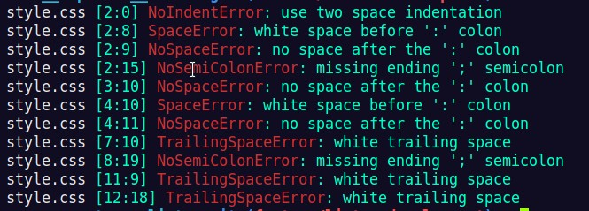

# CSS Linter Capstone

> CSS Linter that analyse the code in a css stylesheet for potential errors.

The errors that can detect are:

- Indentation
- Space before and/or after 'colon', 'semicolon' or 'opening bracket'
- Ending line ';' semicolon
- Trailing white space



Additional description about the project and its features.

## Built With

- Ruby

## Getting Started

To get a local copy up and running follow these simple example steps.

### Prerequisites

- Ruby v 2.7.0
- [gem colorized](https://github.com/fazibear/colorize)

### Clone

Clone into your local system with next command

```git clone git@github.com:jubaan/m__capstone__linter.git```

### Install

1.- go inside the directory of the repo

2.- Run the nex command to install it

```ln -s $PWD/checker /usr/local/bin/```

or

```sudo ln -s $PWD/checker /usr/local/bin/```

NOTE: if you cannot istall it follow the alternative usage

### Usage

If youre were able to install it use the 'checker' linter using

```checker ./path/to/your/file.css```

or if you got an error following the installing process follow

```ruby ./bin/checker.rb ./path/to/your/file.css```

### Examples

No ending ';' semicolon

``` css
selector {
    property: value
}

# raise NoSemiColonError: missing ending ';' semicolon
```

No "two space" indentation

```
selector {
property: value;
}

# raise NoIndentError: use two space indentation
```

## Authors

👤 **Julio Anoveros**

- Github: [@jubaan](https://github.com/jubaan)
- Twitter: [@AnoverosJulio](https://twitter.com/AnoverosJulio)
- Linkedin: [linkedin](https://linkedin.com/linkedinhandle)

## 🤝 Contributing

Contributions, issues and feature requests are welcome!

Feel free to check the [issues page](https://github.com/jubaan/m__capstone__linter/issues?q=is%3Aissue+is%3Aopen+sort%3Aupdated-desc).

## Show your support

Give a ⭐️ if you like this project!

## 📝 License

This project is [MIT](LICENSE.txt) licensed.
